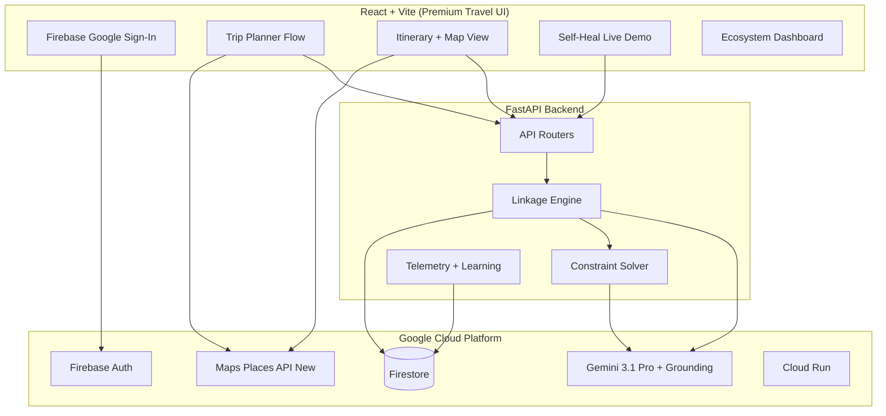

# KUPE — Full Development Plan v2

**Hackathon:** Build With AI 2026 KL — MyHack · 24h Sprint · Sunway University
**Challenge:** Automating Ecosystem Linkages Instead of Manual Coordination
**PoC Domain:** Halal & Accessible Tourism in KL

---

## Rubric Alignment Matrix (40 Points)

| Criteria | Points | Our Strategy |
|---|---|---|
| **Google Tech Integration** | 15 | Gemini 3.1 Pro (core AI), Google Maps Places API (New), Firebase Auth + Firestore, Cloud Run deployment |
| **AI Implementation Quality** | 10 | AI is THE engine (not a chatbot). Structured output for deterministic matching. Grounding with Google Search for hallucination reduction. Ethical AI: bias audit logging, constraint transparency, no PII in prompts |
| **Working Demo & UI/UX** | 10 | Premium Airbnb-grade travel UI. Dark glassmorphism. Skeleton loaders. Map-integrated itinerary. Self-heal animation |
| **AI Model Performance** | 5 | Structured JSON schemas enforce accuracy. Constraint verification is deterministic (not AI-guessed). Confidence scores on every linkage |

---

## Architecture



### Why Each Google Tech

| Technology | Role | Why It's Integral (Not Decorative) |
|---|---|---|
| **Gemini 3.1 Pro** | Core linkage reasoning, ranking, self-healing | Without it, matching is manual — the entire problem statement. Structured output ensures deterministic, schema-compliant linkages |
| **Grounding with Google Search** | Real-time business verification | Reduces hallucination by anchoring AI to live data. Dynamic threshold ensures cost efficiency |
| **Google Maps Places API (New)** | Live business data, coordinates, ratings | Powers the map view and provides real POI data instead of fake seed data |
| **Firebase Auth** | Google Sign-In for travelers | Zero-friction onboarding; Google ecosystem alignment |
| **Firestore** | All data persistence | Real-time listeners for live self-healing updates; free tier sufficient |
| **Cloud Run** | Production deployment | Scale-to-zero; free tier; one-command deploy |

---

## Project Structure

```
Sunway_hackathon/
├── backend/
│   ├── main.py              # FastAPI entry + CORS
│   ├── config.py            # Env vars, constants
│   ├── routers/
│   │   ├── trips.py         # Generate, get, heal, rate
│   │   ├── businesses.py    # CRUD + toggle active
│   │   ├── linkages.py      # Linkage entity endpoints
│   │   └── admin.py         # Analytics dashboard
│   ├── services/
│   │   ├── gemini_client.py # Gemini wrapper + grounding
│   │   ├── linkage_engine.py# Core matching brain
│   │   ├── constraint_solver.py # Hard/soft constraint checks
│   │   ├── self_heal.py     # Auto-replacement logic
│   │   └── telemetry.py     # Outcome tracking
│   ├── models/
│   │   ├── schemas.py       # Pydantic models
│   │   └── linkage.py       # Linkage entity definition
│   ├── utils/
│   │   ├── prompts.py       # All prompt templates
│   │   ├── seed_data.py     # Demo data loader
│   │   └── ethical_ai.py    # Bias audit + transparency logging
│   ├── Dockerfile
│   └── requirements.txt
│
├── frontend/
│   ├── index.html
│   ├── vite.config.js
│   ├── package.json
│   └── src/
│       ├── main.jsx
│       ├── App.jsx
│       ├── firebase.js       # Firebase config + auth
│       ├── api/client.js     # API wrapper
│       ├── styles/index.css  # Full design system
│       ├── pages/
│       │   ├── LandingPage.jsx
│       │   ├── PlannerPage.jsx
│       │   └── DashboardPage.jsx
│       ├── components/
│       │   ├── Navbar.jsx
│       │   ├── HeroSection.jsx
│       │   ├── TripWizard.jsx      # Multi-step booking flow
│       │   ├── ConstraintPicker.jsx # Visual constraint toggles
│       │   ├── ItineraryTimeline.jsx# Day-by-day timeline
│       │   ├── LinkageCard.jsx     # First-class entity viz
│       │   ├── MapView.jsx         # Google Maps integration
│       │   ├── SelfHealDemo.jsx    # Live healing animation
│       │   ├── BusinessCard.jsx    # POI cards
│       │   ├── SkeletonLoader.jsx  # Shimmer loading states
│       │   ├── ConfidenceBadge.jsx # AI confidence indicator
│       │   └── EthicalAIPanel.jsx  # Transparency panel
│       └── hooks/
│           ├── useAuth.js
│           └── useTrip.js
│
├── data/seed/
│   ├── businesses_kl.json
│   └── constraints.json
├── .env.example
└── README.md
```

---

## Data Model (Firestore)

### `businesses` — POI nodes
```json
{
  "id": "biz_001",
  "name": "Nasi Kandar Pelita",
  "type": "restaurant",
  "location": {"lat": 3.157, "lng": 101.711},
  "tags": ["halal_jakim", "malay_cuisine", "budget"],
  "constraints_met": {
    "halal": {"certified": true, "body": "JAKIM"},
    "accessibility": {"wheelchair": true}
  },
  "photos": ["url1"],
  "rating": 4.3,
  "avg_spend_myr": 18,
  "linkage_score": 0.0,
  "success_rate": 0.0,
  "active": true
}
```

### `linkages` — First-class relationship entities (THE innovation)
```json
{
  "id": "link_001",
  "trip_id": "trip_001",
  "traveler_id": "user_abc",
  "business_id": "biz_012",
  "type": "meal_assignment",
  "status": "verified",
  "constraint_checks": [
    {"constraint": "halal", "passed": true, "method": "jakim_db"},
    {"constraint": "wheelchair", "passed": true, "method": "ai_verified"}
  ],
  "strength": 0.85,
  "confidence": 0.92,
  "reasoning": "Selected because: JAKIM-certified, 200m from prev stop, 4.5 rating, matches 'malay_cuisine' preference",
  "outcome": null,
  "healed_from": null,
  "created_at": "2026-05-16T10:05:00Z"
}
```

### `trips` — Programmable itinerary entities
```json
{
  "id": "trip_001",
  "traveler_id": "user_abc",
  "city": "Kuala Lumpur",
  "dates": {"start": "2026-05-20", "end": "2026-05-22"},
  "constraint_profile": ["halal", "wheelchair_accessible"],
  "preferences": ["outdoor", "cultural"],
  "itinerary": [
    {"day": 1, "slots": [
      {"time": "09:00", "linkage_id": "link_001", "type": "breakfast", "status": "verified"}
    ]}
  ],
  "satisfaction_score": null,
  "blueprint_eligible": false
}
```

### `blueprints` — Reusable successful patterns
```json
{
  "id": "bp_001",
  "source_trip_id": "trip_001",
  "constraint_profile": ["halal", "outdoor"],
  "avg_satisfaction": 4.7,
  "times_reused": 142,
  "slot_template": ["..."]
}
```

---

## Ethical AI & Hallucination Mitigation

This section maps directly to the **"AI Implementation Quality"** rubric (10 pts).

### Anti-Hallucination Strategy
1. **Structured Output** — Every Gemini response is forced into a JSON schema via `response_mime_type="application/json"`. No free-text responses that could hallucinate
2. **Grounding with Google Search** — Business existence and hours verified against live web data. Dynamic threshold = 0.3 (search triggered when model is uncertain)
3. **Deterministic Constraint Verification** — Hard constraints (Halal, wheelchair) use boolean checks on stored data, NOT AI judgment. AI ranks; code verifies
4. **Confidence Scoring** — Every linkage carries a 0–1 confidence score. UI displays this transparently to users

### Ethical AI Measures
1. **Bias Audit Logging** — `ethical_ai.py` logs every linkage decision with reasoning. If a demographic consistently gets lower-rated businesses, the log flags it
2. **No PII in Prompts** — Traveler profiles sent to Gemini are anonymized (no names, emails). Only constraint arrays and preference tags
3. **Transparency Panel** — UI component (`EthicalAIPanel.jsx`) shows users: why each business was chosen, what constraints were checked, confidence level
4. **Human Override** — Users can reject any AI suggestion and request re-generation

---

## Frontend — Premium Travel Booking UI

### Design Philosophy
- **Airbnb-grade emotional design**, not a dashboard
- **Dark glassmorphism** with teal/cyan brand palette
- **Inspiration-first**: hero section shows KL imagery before asking for input
- **Skeleton shimmer loaders** during AI generation (not spinners)
- **Micro-animations** via Framer Motion on every interaction

### Design Tokens
```css
:root {
  --kupe-primary: #0D7377;
  --kupe-secondary: #14BDEB;
  --kupe-accent: #FF6B35;
  --kupe-success: #32D583;
  --kupe-warning: #F5A623;
  --kupe-danger: #EF4444;
  --bg-primary: #0A0F1A;
  --bg-card: rgba(17, 24, 39, 0.7);
  --bg-glass: rgba(13, 115, 119, 0.08);
  --border-glass: rgba(255, 255, 255, 0.06);
  --font-display: 'Outfit', sans-serif;
  --font-body: 'Inter', sans-serif;
  --radius-md: 12px;
  --radius-lg: 16px;
  --shadow-glow: 0 0 30px rgba(20, 189, 235, 0.12);
}
```

### Page-by-Page Breakdown

#### 1. Landing Page (`LandingPage.jsx`)
**Feel:** Like opening Airbnb for the first time — cinematic, emotional, inviting

- **Hero Section**: Full-bleed KL skyline gradient background. Large headline: *"Your perfect trip, auto-crafted by AI"*. Subtext explaining constraint-aware travel. CTA: "Plan My Trip" button with glow animation
- **How It Works**: 3-step visual (Profile → AI Generates → You Travel). Animated icons
- **Trust Signals**: Constraint badges (Halal ✓, Wheelchair ✓, Dietary ✓) with explanations
- **Google Sign-In**: Firebase Auth popup. Glassmorphic sign-in card

#### 2. Planner Page (`PlannerPage.jsx`)
**Feel:** Like a premium booking wizard — step-by-step, no overwhelm

- **TripWizard** (multi-step form with progress bar):
  - **Step 1 — Destination**: City selector with beautiful card thumbnails (KL for demo)
  - **Step 2 — Dates**: Date range picker with animated calendar
  - **Step 3 — Constraints**: `ConstraintPicker.jsx` — large visual toggle cards (not checkboxes). Halal card with crescent icon, Wheelchair card, Dietary card with food icons. Each card flips on selection with spring animation
  - **Step 4 — Preferences**: Tag chips for interests (Outdoor, Cultural, Shopping, Food, Photography). Budget slider (Budget → Mid → Premium). Pace selector (Relaxed → Moderate → Adventurous)
  - **Step 5 — Generate**: Summary review → "Generate My Trip" CTA

- **Loading State**: Full-screen `SkeletonLoader.jsx` mimicking the itinerary layout. Shimmer animation. Status messages: "Analyzing constraints..." → "Finding verified businesses..." → "Building your route..." → "Verifying Halal certifications..."

#### 3. Itinerary Page (replaces PlannerPage after generation)
**Feel:** Like a travel app showing your confirmed booking

- **ItineraryTimeline**: Vertical timeline with day separators. Each slot is a `BusinessCard` with: photo, name, type badge, time, constraint badges (green ✓), confidence meter, distance from previous stop
- **MapView**: Google Maps on the right (desktop) or toggleable (mobile). Route polylines connecting stops. Color-coded pins matching timeline. Click pin → highlights corresponding timeline slot
- **LinkageCard** (expandable on click): Shows the "programmable relationship" visually. Constraint audit trail. AI reasoning text. Strength/confidence meters. "This is not just a recommendation — it's a verified, programmable connection"
- **SelfHealDemo**: Red "Simulate Closure" button on any business. When clicked: business card turns red → "Finding replacement..." skeleton → new card slides in (green glow) → reasoning panel explains why the new choice was made → map route updates live

#### 4. Dashboard Page (`DashboardPage.jsx`)
**Feel:** Admin/ecosystem owner view — clean analytics

- Platform stats: total linkages created, avg confidence, blueprints saved
- Business leaderboard (sorted by linkage_score)
- Blueprint library: successful trip patterns available for reuse
- Self-heal success rate chart

### Key UI Components Detail

#### `ConstraintPicker.jsx`
```
┌─────────────────┐  ┌─────────────────┐  ┌─────────────────┐
│   ☪ HALAL       │  │   ♿ ACCESSIBLE  │  │   🥬 DIETARY    │
│                 │  │                 │  │                 │
│ JAKIM Certified │  │ Wheelchair      │  │ Vegetarian      │
│ restaurants &   │  │ accessible      │  │ Gluten-free     │
│ venues only     │  │ venues only     │  │ Nut-free        │
│                 │  │                 │  │                 │
│  [  ENABLED  ]  │  │  [ DISABLED  ]  │  │  [ DISABLED  ]  │
└─────────────────┘  └─────────────────┘  └─────────────────┘
```
Each card: glassmorphic background, icon at top, description, animated toggle. Selected state: teal border glow + filled toggle.

#### `LinkageCard.jsx` — The Demo Differentiator
```
┌──────────────────────────────────────────────────┐
│  🔗 LINKAGE #link_001                    VERIFIED │
│──────────────────────────────────────────────────│
│  Traveler: Ahmad (Family, Muslim)                │
│       ↕  PROGRAMMABLE CONNECTION                 │
│  Business: Nasi Kandar Pelita                    │
│──────────────────────────────────────────────────│
│  Constraint Checks:                              │
│    ☪ Halal (JAKIM)     ✅ Passed                 │
│    ♿ Wheelchair        ✅ Passed                 │
│    💰 Budget (< RM30)  ✅ Passed                 │
│──────────────────────────────────────────────────│
│  Confidence: ████████░░ 85%                      │
│  Strength:   █████████░ 92%                      │
│──────────────────────────────────────────────────│
│  AI Reasoning: "Selected because JAKIM-certified,│
│  200m from previous stop, 4.5★ rating, matches   │
│  'malay_cuisine' preference tag"                 │
│──────────────────────────────────────────────────│
│  ⚡ This linkage is a FIRST-CLASS ENTITY.        │
│  It self-verifies, carries logic, and can heal.  │
└──────────────────────────────────────────────────┘
```

#### `SelfHealDemo.jsx` — The Wow Moment
```
Before:  [Nasi Kandar Pelita] ──🔗── [Ahmad]  ✅ VERIFIED
          ↓ Click "Simulate Closure"
During:  [Nasi Kandar Pelita] ──💔── [Ahmad]  ❌ BROKEN
          ↓ AI searching... (shimmer skeleton)
After:   [Village Park Nasi Lemak] ──🔗── [Ahmad]  ✅ HEALED
          + Reasoning: "Replaced with Village Park: same JAKIM
            certification, 400m away, 4.6★, matches cuisine pref"
```

---

## Backend — Key Service Logic

### `gemini_client.py`
```python
import google.generativeai as genai

model = genai.GenerativeModel(
    model_name="gemini-3.1-pro",
    system_instruction="""You are KUPE's Linkage Engine.
    You match travelers to businesses as PROGRAMMABLE RELATIONSHIPS.
    Hard constraints (halal, accessibility) are NON-NEGOTIABLE.
    Optimize: constraint compliance > proximity > rating > novelty.
    Always provide reasoning for every match.""",
    generation_config=genai.GenerationConfig(
        response_mime_type="application/json",
        thinking_config=genai.ThinkingConfig(thinking_budget=1024),
    ),
    tools=[genai.Tool(google_search=genai.GoogleSearch())]  # Grounding
)
```

### `linkage_engine.py` — Core Flow
```
generate_trip(traveler, city, dates)
  ├── 1. Extract constraint_profile from traveler
  ├── 2. Query Firestore for businesses matching hard constraints
  ├── 3. Send candidates + profile to Gemini (structured output)
  ├── 4. Gemini returns ranked matches with reasoning
  ├── 5. For each match: create_linkage() with constraint_checks
  ├── 6. Assemble itinerary with time slots
  └── 7. Return trip with all linkage entities

heal_linkage(broken_linkage)
  ├── 1. Get constraint_profile from original linkage
  ├── 2. Query candidates EXCLUDING broken business
  ├── 3. Send to Gemini with context (prev/next slots)
  ├── 4. Create new linkage with healed_from = old_id
  └── 5. Update trip atomically
```

### `ethical_ai.py` — Bias Audit
```python
async def log_decision(linkage, candidates, chosen, rejected):
    """Log every AI decision for transparency and bias detection."""
    audit = {
        "timestamp": now(),
        "linkage_id": linkage.id,
        "total_candidates": len(candidates),
        "chosen": {"id": chosen.id, "rating": chosen.rating},
        "rejected_sample": [{"id": r.id, "rating": r.rating} for r in rejected[:3]],
        "reasoning": linkage.reasoning,
        "constraint_checks": linkage.constraint_checks,
        "confidence": linkage.confidence
    }
    await firestore.collection("audit_log").add(audit)
```

---

## API Endpoints

| Method | Endpoint | Purpose |
|---|---|---|
| `POST` | `/api/trips/generate` | AI-generate full itinerary |
| `GET` | `/api/trips/{id}` | Get trip + linkages |
| `POST` | `/api/trips/{id}/heal/{slot}` | Self-heal a specific slot |
| `POST` | `/api/trips/{id}/rate` | Submit satisfaction |
| `GET` | `/api/businesses` | List with filters |
| `PATCH` | `/api/businesses/{id}/toggle` | Toggle active (demo) |
| `GET` | `/api/linkages/{id}` | Full linkage entity |
| `GET` | `/api/admin/stats` | Platform analytics |
| `GET` | `/api/admin/blueprints` | Reusable patterns |

---

## Demo Script (5 min)

| # | Time | Action | Rubric Points Hit |
|---|---|---|---|
| 1 | 0:30 | Problem pitch + ecosystem linkage framing | Context |
| 2 | 0:30 | Google Sign-In → Profile setup | Google Tech (15) |
| 3 | 0:30 | Select Halal + Wheelchair constraints | UI/UX (10) |
| 4 | 0:45 | Generate trip → show shimmer → full itinerary + map | AI Quality (10), UI/UX |
| 5 | 0:30 | Click linkage → show first-class entity card | Innovation |
| 6 | 1:00 | **Self-heal demo**: close restaurant → AI replaces → reasoning shown | AI Performance (5) |
| 7 | 0:30 | Show transparency panel (constraint checks, confidence) | Ethical AI |
| 8 | 0:30 | Admin dashboard: blueprints, analytics | Scalability |
| 9 | 0:45 | Scale pitch: same engine for mentors↔startups, London, Tokyo | Challenge alignment |

---

## 24-Hour Timeline

| Hours | Focus | Deliverable |
|---|---|---|
| 0–2 | Setup: Vite + FastAPI scaffold, Firebase project, env vars, seed data | Skeleton running |
| 2–5 | `gemini_client.py`, `linkage_engine.py`, `constraint_solver.py` | Trip generation API working |
| 5–7 | `self_heal.py`, `ethical_ai.py`, telemetry | Self-heal + audit API working |
| 7–10 | Landing page, TripWizard, ConstraintPicker | Premium booking flow |
| 10–13 | ItineraryTimeline, MapView, LinkageCard | Full itinerary experience |
| 13–15 | SelfHealDemo, EthicalAIPanel, animations | Wow features complete |
| 15–17 | Dashboard, polish, responsive | All pages done |
| 17–19 | Cloud Run deploy, end-to-end test | Live URL |
| 19–21 | Bug fixes, demo rehearsal | Stable |
| 21–24 | Presentation prep, README, buffer | Ready to present |

> [!WARNING]
> **Scope cuts if behind**: Drop Dashboard first, then Blueprint features. Protect: Trip Generation + Self-Heal Demo + Linkage Card. These three win the hackathon.

---

## Dependencies

**Backend** (`requirements.txt`):
```
fastapi==0.115.0
uvicorn[standard]==0.34.0
google-generativeai==0.8.0
google-cloud-firestore==2.19.0
pydantic==2.10.0
python-dotenv==1.0.0
```

**Frontend** (`package.json` deps):
```
react, react-dom, react-router-dom
@react-google-maps/api
axios
framer-motion (motion)
lucide-react
firebase
```

---

## Open Questions

> [!IMPORTANT]
> **Q1**: How many team members and what are their skills? This determines task split.

> [!IMPORTANT]
> **Q2**: Do you have a GCP project with billing + Gemini API key ready?

> [!IMPORTANT]
> **Q3**: If behind schedule — prioritize (a) premium UI with basic AI, or (b) powerful AI demo with simpler UI? I recommend (b).

> [!NOTE]
> **Q4**: Presenting on laptop screen or projector? Determines responsive priority.
